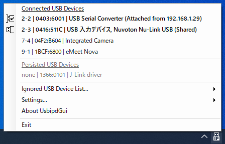
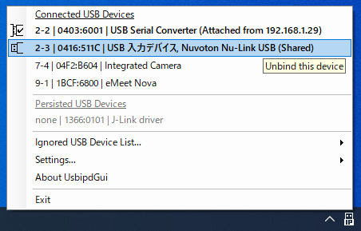
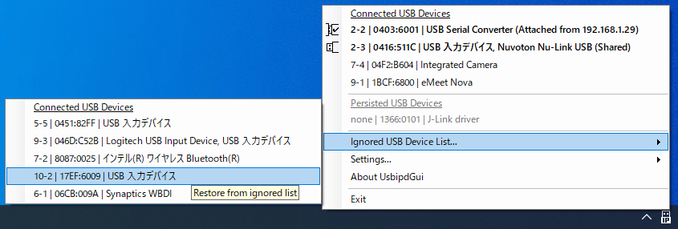

# UsbipdGui: USBIP GUI for Windows
This application is a GUI wrapper for [dorssel/usbipd-win](https://github.com/dorssel/usbipd-win) that is a awesome USB/IP service for Windows.  
UsbipdGui is simple, runs only on the system tray.

## Setup
Before using this application, the usbipd-win must be set up according to "[Connect USB devices | Microsoft Learn](https://learn.microsoft.com/en-us/windows/wsl/connect-usb)".

## Features
  
UsbipdGui provides the following features to make sharing USB devices easier with just a mouse operation.

- Display connected USB devices
- Bind/Unbind connected USB devices
- Display persisted (disconnected) USB devices
- Ignore specified USB devices
- Run at startup

> [!NOTE]
> UsbipdGui requires administrative permission to bind/unbind USB devices.

## Usage
All functions are performed on a context menu that is opened by right-clicking on the system tray icon.

### Bind USB devices
  
By left-clicking on a connected USB device that has not yet been shared, we can share (bind) that device.
Shared USB devices are marked with "(Shared)".  

> [!NOTE]
> UsbipdGui will always force bind.

### Unbind USB devices
  
By left-clicking on a shared (binded) USB device, we can stop sharing (binding) that device.

### Ignore USB devices
  
By right-clicking on a connected USB device that has not yet been shared, we can add that device to the ignore list.
Devices added to the ignore list will no longer appear in the "Connected USB Devices" list.

### Restore from ignored device list
  
To restore devices added to the ignore list, view the devices on the ignore list from "Ignore USB Device List..." and left-click on them.
